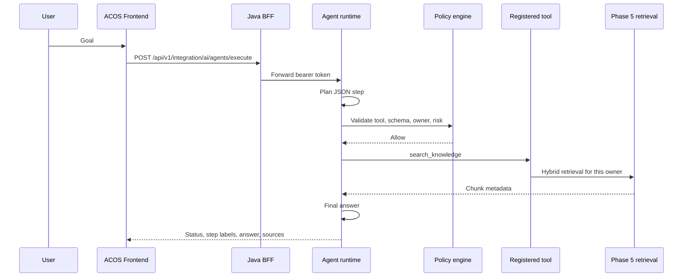

# Phase 9 — Controlled agent foundation

The assistant still answers one question. The agent accepts a goal, proposes a small number of read-only tool calls, and returns an answer with sources. ACOS stays the owner of knowledge, users, and publishing.

## Lifecycle

`CREATED` → `PLANNING` → `EXECUTING` → `COMPLETED`, `FAILED`, or `CANCELLED`. A high-risk proposal stops at `WAITING_FOR_APPROVAL`. The stored record keeps the tool name, version, safe arguments, result counts, status, model, and token totals. It does not store chain-of-thought.

## Tools

| Tool | Permission | Risk | Behavior |
| --- | --- | --- | --- |
| `search_knowledge.v1` | `READ_KNOWLEDGE` | LOW | Phase 5 retrieval for the caller |
| `retrieve_knowledge.v1` | `READ_KNOWLEDGE` | LOW | Same retrieval, filtered to one content id |
| `search_conversations.v1` | `READ_CONVERSATION` | LOW | The caller's conversation text only |
| `search_content.v1` | `READ_CONTENT` | LOW | Retrieval filtered by note or tutorial |

Unknown tools are denied. Write, publish, payment, shell, SQL, Python, and HTTP tools are not registered.

## Policy and approval

The caller must already be authenticated. Tool permissions for a normal user are the three read permissions above. An `owner_id` or `tenant_id` in the arguments that does not match the token subject is denied. ACOS isolates by owner; that owner is the tenant boundary.

High-risk proposals require the owner to approve or reject. Approval is stored and the tool is still not executed, because this phase does not enable high-risk tools. Future write tools must be idempotent. This phase does not add them.

## Budgets

`AI_AGENT_MAX_STEPS` (5), `AI_AGENT_MAX_TOOL_CALLS` (10), `AI_AGENT_MAX_TOKENS` (8000), `AI_AGENT_TIMEOUT_SECONDS` (60), `AI_AGENT_TOOL_TIMEOUT_SECONDS` (10), and `AI_AGENT_MAX_ESTIMATED_COST_USD` (1). The same tool and arguments stop after `AI_AGENT_LOOP_REPEAT_LIMIT` proposals. Execution state is in the conversation SQLite file, so a restart can still load it. The HTTP call itself finishes within the agent timeout, so there is no separate job queue.

## Security

Retrieved snippets and tool results are labeled untrusted in the next planner message. They cannot authorize a tool. The executor only receives a registry object. There is no path from model text to `eval`, a shell, SQL, or an arbitrary HTTP client.

## Observability

Metrics use the `acos_ai_agent_` prefix for executions, success, failure, steps, tool calls, denials, approvals, loops, timeouts, tokens, cost, and latency. Spans are `ai.agent`, `ai.agent.plan`, `ai.agent.policy`, `ai.agent.tool`, `ai.tool.<name>`, `ai.agent.observe`, and `ai.agent.complete`, with `execution_id` and `conversation_id`.

## Evaluation

`app/orchestration/agent/evaluation.py` lists the ten golden tasks: knowledge lookup, multi-step lookup, ambiguous request, no result, unauthorized tool, prompt injection, tool failure, repeated search, budget exhaustion, and cancellation. The unit tests execute those outcomes with a scripted planner.

## API

`POST /api/v1/ai/agents/execute` with `{ "goal", "conversationId" }`. `GET /api/v1/ai/agents/executions/{id}`, `POST .../cancel`, and `POST .../decision` with `{ "decision": "APPROVE" | "REJECT" }`. The browser calls the Java routes under `/api/v1/integration/ai/agents`. The Analyze with AI page shows step labels, the answer, sources, and an approval card. It does not replace Ask ACOS AI.
