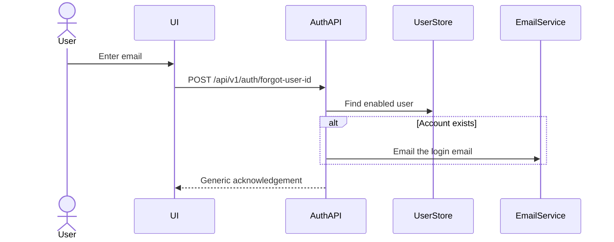
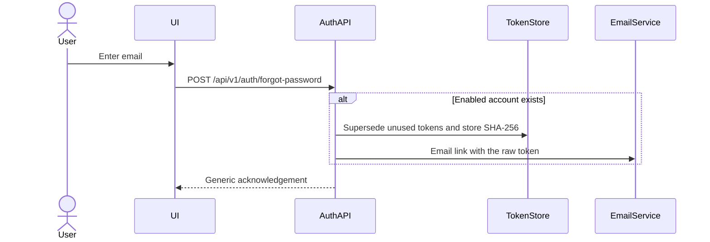
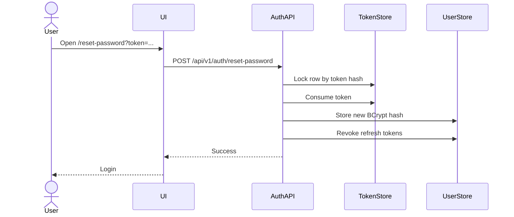
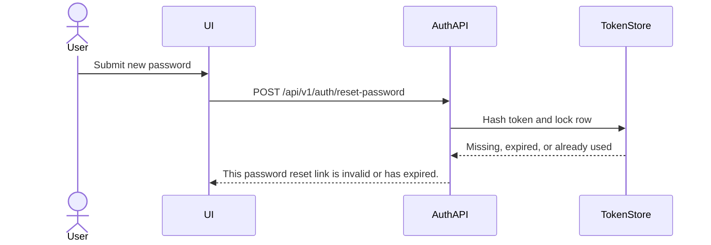
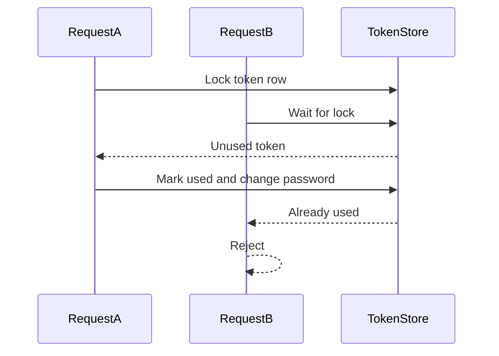

# Account recovery

Login uses the account email. There is no separate username. Forgot User ID emails that email
address. The HTTP response never contains it.

## Flows

### Forgot User ID

### Forgot Password

### Reset Password

### Invalid reset token

### Concurrent reset

## Token lifecycle

A new reset request marks unused tokens for that user as used, then stores a new SHA-256 hash.
The raw token is 32 random bytes, Base64 URL encoded, and is only placed in the email link.
The link origin comes from `acos.recovery.frontend-base-url`. The request cannot choose the host.

Default lifetime is 30 minutes (`acos.recovery.token-ttl`). Expiry is checked when the token is
consumed. There is no scheduler; `deleteByUsedAtIsNullAndExpiresAtBefore` is available for storage
hygiene only.

## Email

The platform has no SMTP integration. `LoggingAccountMailSender` records that a message was
accepted and does not log the address, identifier, or reset URL. A mail failure still returns the
generic acknowledgement. The token row remains so a later delivery mechanism can be added without
changing the public contract.

## Rate limiting

Public recovery endpoints share an in-memory limiter: 5 requests per email per hour and at least
60 seconds between requests. A limited request returns the same generic message.

## Sessions

Refresh tokens for the account are revoked when a reset succeeds. Access JWTs are stateless and
remain valid until `acos.jwt.access-token-ttl` elapses.

## API

| Method | Path | Public response |
| --- | --- | --- |
| POST | `/api/v1/auth/forgot-user-id` | Generic acknowledgement |
| POST | `/api/v1/auth/forgot-password` | Generic acknowledgement |
| POST | `/api/v1/auth/reset-password` | Empty success, or invalid-token / weak-password error |
